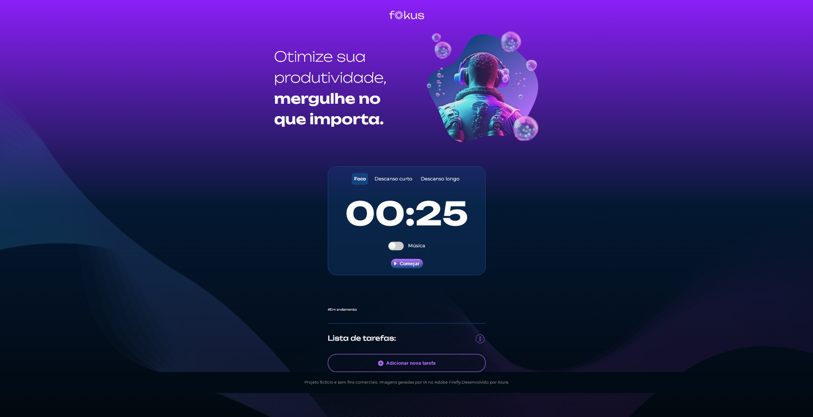

# Fokus

## ℹ️ Sobre

Projeto utilizado no curso para aprendizado das técnicas e melhores práticas.

## 📘Ementa

### JavaScript: explorando a manipulação de elementos e da localStorage

- Identificar e utilizar seletores CSS para interagir com elementos HTML através do JavaScript
- Aplicar conhecimentos de JavaScript para manipular o DOM
- Gerenciar eventos do usuário, como cliques ou envios de formulário
- Resolver problemas relacionados à gestão de estado em aplicações web, utilizando armazenamento local e manipulação de array
- Criar interfaces interativas utilizando elementos dinâmicos e eventos para melhorar a experiência do usuário
- Avaliar e implementar estratégias eficientes para a persistência de dados no navegador do cliente através do LocalStorage
- Projetar uma aplicação web funcional que emprega práticas de armazenamento e recuperação de dados para persistência de estado entre sessões

## 🖥️ Tecnologias

  
  
  

## 🧑‍🏫 Instrutor(es)

| [ Luan Alves](https://github.com/viniciosneves) |
| :---------------------------------------------------------------------------------------------------------------------------------------------------: |

## 💻 Screenshot

